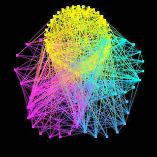

GraphMaker
========
A repository for creating random graphs, reading _.GRAPH_ files, community detection and visualising the results. 



Dependencies
--------
freeglut  

Installation
--------
This repository was built in Windows MinGW for GNU compatibility. The _freeglut_ library is freely available on other platforms.

**Windows:**
Download and install **MinGW** along with **MSYS** if and as required.

Open the MSYS console and download this repository:
```
git clone https://github.com/TeaHarvester/GraphMaker
```
Enter the root directory and compile from source:
```
cd GraphMaker
```
```
make
```