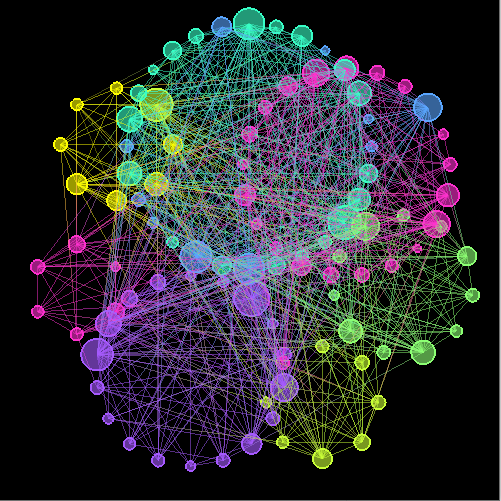
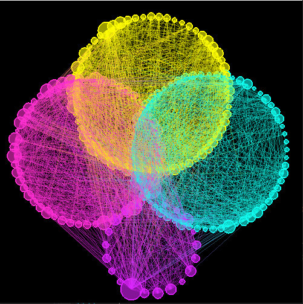

GraphMaker
========
A repository for creating random graphs, reading _.graph_ files, community detection, and visualising the results. 



Dependencies
--------
freeglut  

Example Usage
--------

Detect communities in a Jazz band collaboration network, 1912 to 1940 (see: [_Community Structure in Jazz_](https://arxiv.org/pdf/cond-mat/0307434.pdf))
```
GraphicObject* gl_input;

main(int argc, char **argv)
{
    // import graph from .graph file
    Graph jazzgraph("graphs\\jazz.graph")

    // run community detection
    jazzgraph.louvain(jazzgraph, 0)

    // create GraphicObject to be used by Render()
    GraphicObject g(jazzgraph);

    // assign this object's address to the global input of Render()
    gl_input = &g;

    ...

```
__Output Jazz band network:__ 




Installation
--------
This repository was built in Windows MinGW for GNU compatibility. The _freeglut_ library is freely available on other platforms.

**Windows:**
Download and install **MinGW** along with **MSYS** if and as required.

Open the MSYS console and download this repository:
```
git clone https://github.com/TeaHarvester/GraphMaker
```
Enter the root directory and compile from source:
```
cd GraphMaker
```
```
make
```